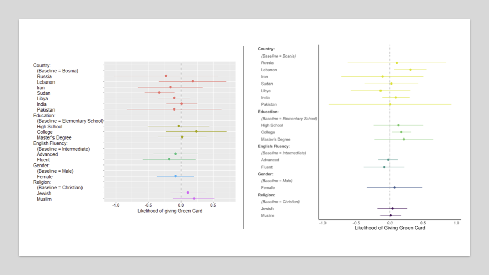
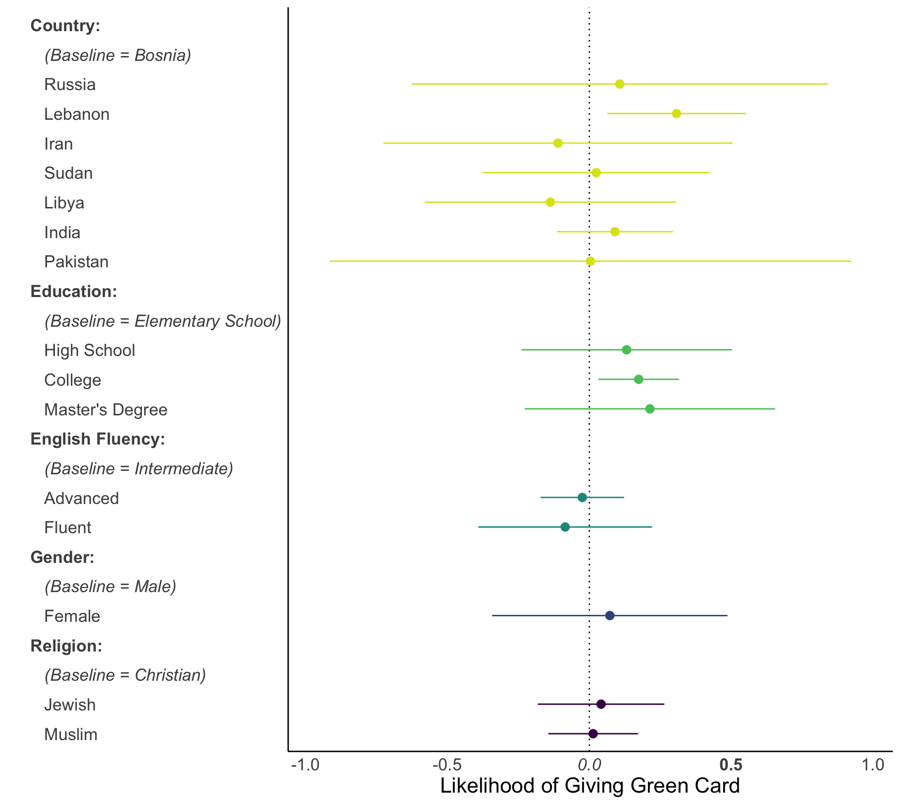

# Customizing-cjoint-Plots
A quick and easy guide to modifying and customizing the look of your AMCE plot outputs from `cjoint`. The figure below shows the comparison between the default plots produced with `cjoint` relative to the customized plots using the code provided, below. 



## Load Libraries

```{r} 
library(cjoint)
library(car)
library(weights)
library(tidyverse)
```

## Load Data 

In this case, I have created a sample dataset that can be used and tweaked for the purpose of this tutorial. **Note**: I have specified the factor levels of each variable. This is key when plotting variables in a specific order and when determining the reference/base group.

```{r}
samp_dat <-
  tibble(
    ## Use `factor` in order to label the factor levels
    Country = sample(
      c(
        "Bosnia",
        "Russia",
        "Lebanon",
        "Iran",
        "Sudan",
        "Libya",
        "India",
        "Pakistan"
      ),
      size = 80,
      replace = T
    )
    %>% factor(
      levels = c(
        "Bosnia",
        "Russia",
        "Lebanon",
        "Iran",
        "Sudan",
        "Libya",
        "India",
        "Pakistan"
      )
    ),
    Education = sample(
      c(
        "Elementary School", 
        "High School", 
        "College", 
        "Master's Degree"
        ),
      size = 80,
      replace = T
    ) %>% factor(
      levels = c(
        "Elementary School", 
        "High School", 
        "College", 
        "Master's Degree"
        )
      ), 
    Gender = sample(
      c(
        "Male", 
        "Female"
        ), 
      size = 80, 
      replace = T
      ) %>% factor(
        levels = c(
          "Male", 
          "Female"
          )
        ),
    ## You can use `these hashes` and `tidyverse` to create column names that are non-traditional (including spaces)
    `English Fluency`  = sample(
      c(
        "Intermediate", 
        "Advanced", 
        "Fluent"
        ),
      size = 80,
      replace = T
    ) %>% factor(
      levels = c(
        "Intermediate", 
        "Advanced", 
        "Fluent"
        )
      ),
    Religion = sample(
      c("Christian", 
        "Jewish", 
        "Muslim"
        ),
      size = 80,
      replace = T
    ) %>% factor(
      levels = c(
        "Christian", 
        "Jewish", 
        "Muslim"
        )
      ),
    greencard = sample(
      c(0, 1), 
      size = 80, 
      replace = T
      ),
    respondent = rep(
      c(1:4), 
      20
      )
  )
```

## Graphing AMCEs

### Main Effects Graph
Here, I include some code that is useful when modifying or customizing the plot to fit your needs. In this example, I have removed the grid lines in the plot, the background is white, and the labels are changed such that the category/variable is in **bold**, the reference/base group is in *italics*, and the other groups are in plain text. 

The code is commented to indicate which codes correspond with plot modifications.

In this code, I have selected colors from the Viridis Palette. This [palette generator](https://waldyrious.net/viridis-palette-generator/) is helpful!

```{r}
samp_dat %>%
  ## The analyses with `formula` argument necessary
  amce(
    formula = greencard ~ Education + Gender + `English Fluency` + Religion + Country,
    respondent.id = "respondent"
  ) %>% 
  ## Plot the AMCE as normal
  plot(
      #add colors from viridis pallet; 5 colors for 5 attributes
    col = c("#DCE319", "#55C667", "#1F968B", "#39568C", "#440154"),
    ## X-Axis label
    xlab = "Likelihood of giving Green Card",
    ## Changing the plot theme
    plot.theme = theme(
      ## Making the text on Y-Axis horizontally justified
      axis.text.y = element_text(hjust = (0)),
      ## Removing the X and Y-Axis tick lines
      axis.ticks = element_blank(),
      ## Changing the text options
      text = element_text(
        ## Changing text size
        size = 16,
        ## Here, I make the category bold text, the baseline italics, and rest plain text
        ### You have to start from the bottom upward
        face = c(
          # Religion
          ## "Muslim" in plain text
          "plain",
          ## "Jewish" in plain text
          "plain",
          ## Baseline of "Christian" in italics
          "italic",
          ## Category of "Religion" in bold
          "bold",
          # Gender
          "plain",
          "italic",
          "bold",
          # English Fluency 
          "plain",
          "plain",
          "italic",
          "bold",
          # Education
          "plain",
          "plain",
          "plain",
          "italic",
          "bold",
          # Country
          "plain",
          "plain",
          "plain",
          "plain",
          "plain",
          "plain",
          "plain",
          "italic",
          "bold"
        )
      ),
      ## No legend
      legend.position = 'none',
      ## No major or minor grid lines
      panel.grid.major = element_blank(),
      panel.grid.minor = element_blank(),
      ## No color in the panel background
      panel.background = element_blank(),
      axis.line = element_line(colour = "black")
    )
  )
```



### Interactions

We can do the same modifications when we are interested in conditional AMCEs. In this example, we are graphing the likelihood of being awarded a green card conditional on both religion and country of origin. 

```
samp_dat %>%
  amce(
    formula = greencard ~ Education + Gender + `English Fluency` + Religion * Country,
    respondent.id = "respondent",
    ## Adding in interaction 
    respondent.varying = "Religion"
  ) %>%
  plot(
      ## add one color this time; color from viridis
    col = c("#440154"),
    plot.display = "interaction",
    xlab = "Likelihood of giving Green Card",
    plot.theme = theme(
      axis.text.y = element_text(hjust = (0)),
      axis.ticks = element_blank(),
      text = element_text(
        size = 16,
        face = c(
          # Country
          "plain",
          "plain",
          "plain",
          "plain",
          "plain",
          "plain",
          "plain",
          "italic",
          "bold"
        )
      ),
      legend.position = 'none',
      panel.grid.major = element_blank(),
      panel.grid.minor = element_blank(),
      panel.background = element_blank(),
      axis.line = element_line(colour = "black")
    )
  )
```


